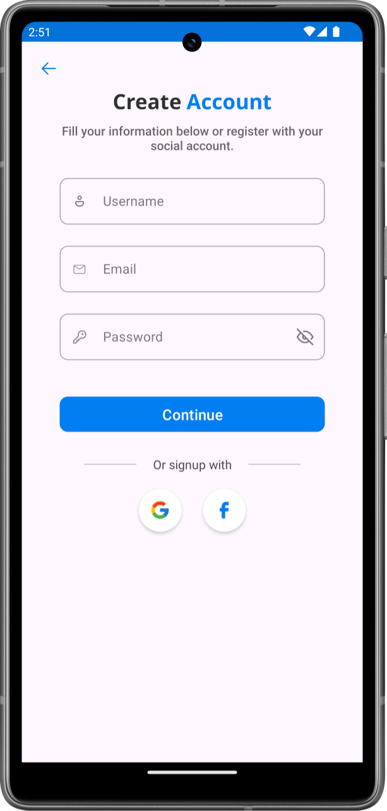
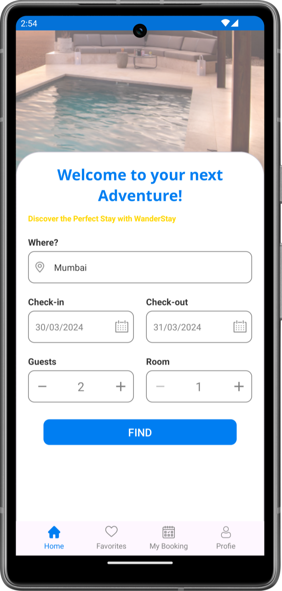

# Hotel Booking App (Android)

Welcome to my Hotel Booking App project! This Android application is part of my portfolio to showcase my skills in mobile app development using Kotlin.

## Overview

The Hotel Booking App is an Android application designed to facilitate hotel reservations for users. It allows users to search for hotels, view available rooms, and make reservations seamlessly. The app aims to provide a user-friendly interface and a smooth booking experience.

<h2 align="left">

Screenshots
</h2>

## Features

### 1. User Authentication

- **Sign up**: Users can create an account by providing necessary details such as name, email, and password.
- **Login**: Registered users can log in securely to access the booking functionalities.
- **Social Logins**: Supports login with social platforms like Google and Facebook.

### 2. Hotel Search

- **Search by Location**: Users can search for hotels based on their desired location, such as city or landmark.
- **Filtering**: Users can apply filters like price range, star rating, amenities, etc., to refine their search results.

### 3. Room Reservation

- **View Available Rooms**: Users can see available rooms for selected dates and hotel.
- **Reservation**: Users can select the desired room and proceed to make a reservation by providing necessary details like check-in/check-out dates, number of guests, etc.

### 4. User Dashboard

- **Reservation Management**: Users can view their past and upcoming reservations.
- **Favorites**: Users can add their favorite hotes in wishlist.

## Technologies Used

- **Language**: 100% Kotlin
- **Development Platform**: Android Studio
- **RESTApi**: Tipster CO
- **Authentication**: Firebase Authentication
- **Architecture pattern**: MVVM(Google's Recommended)

## Installation

The Hotel Booking App is currently available for Android devices only. To install the app, follow these steps:

1. [Download Apk](https://manish99verma.github.io/my-portfolio/assets/apks/hotel-booking-app.apk)
2. Enable installation from unknown sources in your device settings.
3. Install the APK file on your Android device.
4. Open the app and start exploring hotels and making reservations!

## Contact

For any inquiries or feedback, feel free to reach out to me at manish6203993@gmail.com
